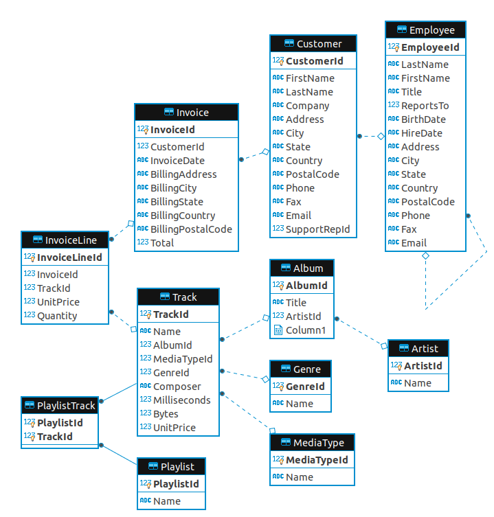

# 🎵 Digital Music Store Analysis (SQL)

## 📊 Project Overview
This project performs an in-depth analysis of a digital music store's database (Chinook Database). The analysis aims to help the business understand its customer base, optimize promotional events, and identify top-performing artists and genres.

## 🛠️ Database Schema
To understand how the data is connected, here is the Entity Relationship Diagram (ERD) of the store:

## 🔍 Key Business Questions Answered
* **Seniority Analysis:** Identified the most senior employee to help with organizational hierarchy.
* **Global Sales:** Determined which countries and cities generate the most revenue to plan future music festivals.
* **Customer Loyalty:** Found the highest-spending customers to target for loyalty rewards.
* **Genre Trends:** Identified that **Rock** is the most popular music genre to guide inventory decisions.
* **Artist Impact:** Found the top 10 Rock bands based on their total track count.

## 💻 SQL Skills Demonstrated
* **Joins:** Combining data from multiple tables like Customer, Invoice, and Track.
* **CTEs:** Organizing complex logic using Common Table Expressions.
* **Window Functions:** Using `ROW_NUMBER` and `PARTITION BY` to rank data.
